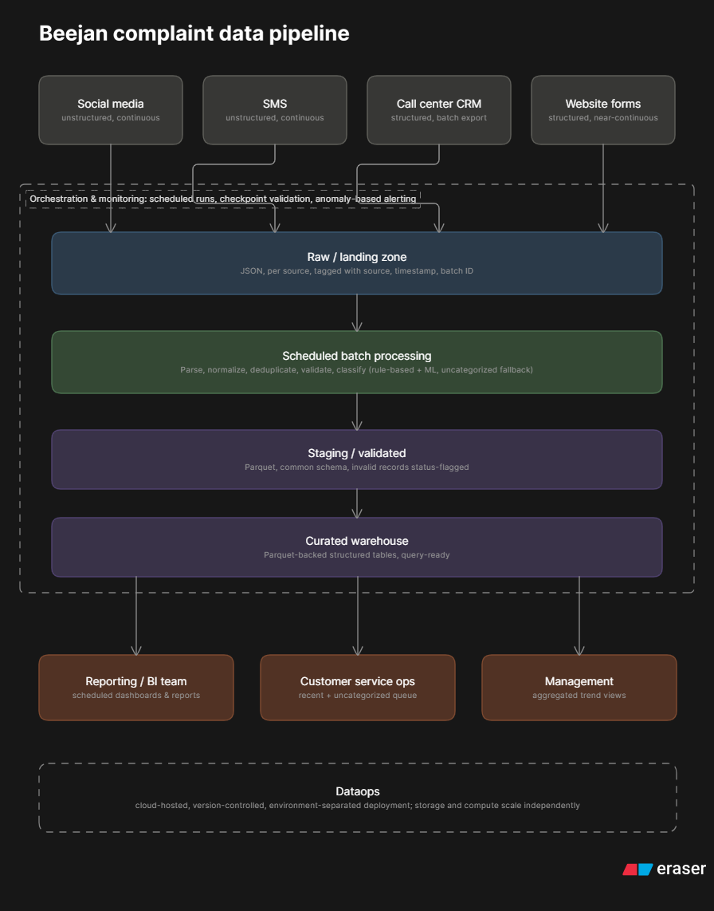

# Beejan Technologies: Conceptual Customer Complaint Data Pipeline

**Author:** Oluwabukunmi Akinmi  
**Context:** Data Engineering Fundamentals Assignment — Core Data Engineering (CDE) Bootcamp

## Overview

Beejan Technologies receives customer complaints through four disconnected channels: social media, SMS, call center logs, and website forms. Data is stored in different formats, reporting is compiled manually, no single pipeline connects the sources, and teams work in silos. This document lays out a conceptual pipeline that ingests, cleans, classifies, stores, and serves this data as a single source of truth.

## 1. Source Identification

| Source | Format | Frequency |
|---|---|---|
| Social media | Unstructured text and metadata (platform, handle, timestamp) | Continuous, bursty |
| SMS | Unstructured short text and metadata (sender, timestamp) | Continuous, bursty, high volume |
| Call center logs | Structured CRM record: customer ID, agent ID, timestamp, free-text notes | Batch, periodic CRM export |
| Website forms | Structured: category, free-text description, customer ID, timestamp | Near-continuous, low volume |

**Assumption:** call center logs are structured CRM notes and metadata, not raw call audio. Transcription and speech processing would be a separate concern and are out of scope here.

## 2. Ingestion Strategy

All four sources are captured continuously as they arrive, but processed on a fixed schedule. This is a two-speed model: capture stays open at all times, processing runs on an interval. It avoids the added complexity of a dual streaming and batch architecture while still capturing fast-moving sources without delay.

Every record lands raw and untransformed in a common landing area, tagged with source, arrival timestamp, and a batch ID. Ingesting raw data first and transforming it later means a transformation bug never corrupts the original record, and reprocessing is possible if classification logic improves down the line.

## 3. Processing and Transformation

Scoped to two things: cleaning and categorizing.

**Cleaning and standardization:**
- Parse every source into one common schema: complaint ID, customer ID, source channel, raw text, timestamp, existing category if any, and metadata
- Normalize text by stripping noise (URLs, excess whitespace) and handling informal or mixed-language content common to SMS and social media
- Deduplicate near-identical complaints across channels so one incident is not counted twice
- Validate records and flag any missing required fields with a status column instead of dropping them silently

**Classification:**
Complaints are classified into categories such as billing, network, or customer service using a hybrid approach: rule-based matching for obvious, high-confidence cases, and a machine learning model for cases that need more context. Anything the system cannot confidently classify falls into an uncategorized bucket for human review. Model training and maintenance are treated as a separate concern from the pipeline itself.

## 4. Storage

Data moves through three layers, each with a format matched to its purpose.

| Layer | Content | Format | Reason |
|---|---|---|---|
| Raw / Landing | As-ingested, per source, untouched | JSON | No fixed schema yet; tolerates messy, inconsistent source data |
| Staging / Validated | Common schema applied, normalized, deduplicated, invalid records flagged | Parquet | Schema is fixed at this point, so columnar storage is efficient for scanning and filtering |
| Curated / Warehouse | Cleaned, classified, ready for reporting | Parquet-backed structured tables | Optimized for the aggregation and filtering queries reporting depends on |

The pattern gives flexibility where it is needed (raw) and query efficiency where it pays off (staging onward).

## 5. Serving

All downstream users query the same curated layer through different views. This is the single-source-of-truth outcome that directly addresses Beejan's stated pain points of silos and delayed reporting.

| User | Access Pattern | Problem Solved |
|---|---|---|
| Reporting / BI team | Scheduled queries feeding dashboards and reports | Replaces manual spreadsheet compilation |
| Customer service ops | Filtered view of recent and uncategorized complaints | Faster triage and visibility into unresolved issues |
| Management | Aggregated trend views by category, channel, and region | Cross-channel visibility that is currently impossible |

## 6. Orchestration and Monitoring

The pipeline runs on a single schedule, cadenced to whichever source needs the fastest turnaround, for example every 15 to 30 minutes. A single schedule keeps the design consistent with the unified batch model chosen in Ingestion instead of reintroducing multi-speed complexity.

Monitoring includes validation checkpoints at each layer boundary: did ingestion receive data from every source, did staging pass a minimum validity rate, did the curated load complete. Alerting is not limited to outright failures. A sudden drop in volume from a normally high-volume source is treated as a silent-failure signal and triggers an alert on its own, since a pipeline that runs successfully on incomplete data is a worse outcome than one that visibly crashes.

## 7. Dataops

The pipeline runs on managed, cloud-hosted compute. Cloud is chosen over on-premises infrastructure for elasticity against bursty social and SMS volume, lower operational overhead, and because storage and compute can scale independently, which matters given the three-layer storage design above.

Pipeline logic is version-controlled and deployed through a repeatable release process, with a test or staging environment ahead of production, rather than being edited directly in a live system.

## Assumptions

- Call center data is structured CRM notes and metadata, not raw audio
- Every source carries, or can be enriched with, a customer identifier for cross-channel correlation
- No source's self-reported category is trusted; classification is the pipeline's responsibility
- A unified batch cadence is acceptable; sub-minute real-time response is not a hard requirement today

## Challenges and Unknowns

- Defining a duplicate complaint across channels is inherently fuzzy and needs real business input, not just a technical rule
- Classification accuracy depends on having enough historically labeled complaints to train against; starting with rules alone is a real near-term limitation
- Language and dialect variation, including informal text and mixed English common in SMS and social media, is not fully solved by basic text normalization
- The batch interval is a trade-off: too frequent raises compute cost and operational overhead, too infrequent reduces how actionable the insights are for time-sensitive complaints
